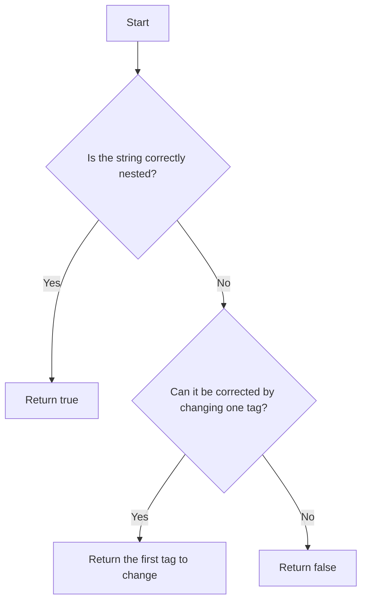

# 🚀 CheckDOM - HTML Element - coderbyte / [Odoo Coding Challenge](https://www.odoo.com/jobs/software-developer-1)

## 📜 Description

Have the function `CheckDOM(strParam)` read the `strParam` parameter being passed which will be a string of HTML elements and plain text.  
The elements that will be used are: `<b>`, `<i>`, `<em>`, `<div>`, `<p>`.

Your program should support 3 cases:
1. the string is a correct sequence of nested HTML elements, it should return `true`
2. the string is almost correct: by changing a single tag you can make it correct, it should **return the first tag to change**. Changing a tag does not include adding or removing a tag, or changing the opening into a closing tag and vice versa.
3. the string is incorrect (and to be correct it would require changing more than one element), your program should return `false`.

## 🧩 Examples

### Example 1
```html
Input: "<div><b><p>hello world</p></b></div>"
Output: true
Reason: the HTML is nested correctly
```

### Example 2
```html
Input: "<div><i>hello</i>world</b>"
Output: "div"
Reason: if the first `<div>` element were changed into a `<b>`, the string would be properly nested
```

### Example 3
```html
Input: "</div><p></p><div>"
Output: false
Reason: the order of opening and closing tags is not respected, changing any one tag cannot make it correct
```

## Example 4

```html
Input: "<em></em><em></em><p></b>"
Output: p
```

## Example 5

```html
Input: "< div>< p></p>< b><p></div>"
Output: false
```


## 🔍 Browse Resources

Search for any help or documentation you might need for this problem. For example: array indexing, Ruby hash tables, etc.

---

## 🎨 Visual Representation




## 🌟 Star the Repo
If you find this project helpful, please consider giving it a star ⭐ on GitHub!

[](https://github.com/salimt/CheckDOM-Challenge-Assignment)

## 📜 License
This project is licensed under the MIT License - see the LICENSE file for details.

<sup>Keywords: odoo coding challenge, Odoo developer position, odoo coding test, Odoo assessment, odoo coderbyte, odoo technical assessment, odoo belgium, odoo europe, odoo india</sup>
